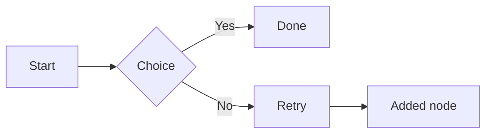

# Markdown Elements — Baseline

Reference document with common Markdown / GFM elements supported in Black Beard Editor.

**Added standalone paragraph after the intro.**

## Headings666555

### Third level

#### Fourth level

##### Fifth level

###### Sixth level

### Added heading block (inserted)

## Inline text

Plain paragraph with **bold**, *italic*, ~~strikethrough~~, ***bold italic***, `inline code`, and a [link to Apple](https://www.apple.com "Apple home").

Added sentence at end of inline section.

Autolink test: <https://example.com>

<https://added.example.org>

Line with explicit break (two trailing spaces):  
Second line after soft break.

Added line after soft-break paragraph.

## Blockquote

> Blockquote line one.
> Blockquote line two with **bold** and `code` inside.
> Added blockquote line three.

## Thematic break

---

## Unordered list

- North item
- Added unordered item
- Center item
  - Nested alpha
  - Added nested item
  - Nested beta
- South item

## Ordered list

1. Prepare
2. Added ordered step
3. Execute
  1. Sub-step A
  2. Added sub-step
  3. Sub-step B
4. Review

## Task list

- [x] Completed task
- [x] Added completed task
- [ ] Open task
- [ ] Another open task
- [ ] Added open task

## Fenced code (Swift)

```swift
struct Article {
    let title: String
    let wordCount: Int
}
// added line below
let added = true
```

## Fenced code (plain)

```
plain text block
no language tag
added plain line
```

## Mermaid diagram



## Table

| Feature     | Status | Notes        |
|-------------|--------|--------------|
| Headings    | OK     | H1–H6        |
| Tables      | OK     | GFM style    |
| Code blocks | OK     | Highlighting |
| Images      | OK     | Local paths  |
| Diff        | OK     | Added row    |

## Image


## Math

Inline: $E = mc^2$

Inline added: $a^2 + b^2 = c^2$

Display:

$$\sum_{i=1}^{n} i = \frac{n(n+1)}{2}$$

$$\int_0^1 x^2 \, dx = \frac{1}{3}$$

## Raw HTML snippet

<kbd>Cmd</kbd> + <kbd>S</kbd> to save.

<strong>Added HTML bit.</strong>

## Inserted section

New block inserted before closing.

- Item in new section
- Second item

## Closing

Final paragraph. Fixture label: **baseline**.

Added closing sentence.
