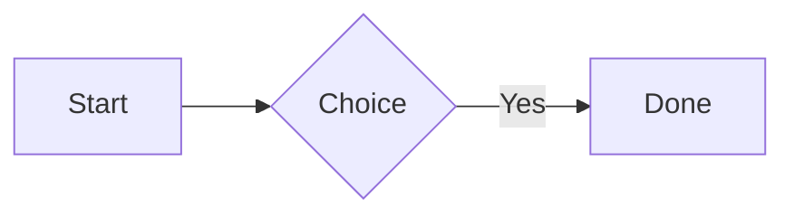

# Markdown Elements — Baseline

Reference document with common Markdown / GFM elements supported in Black Beard Editor.

## Headings

### Third level

#### Fourth level

###### Sixth level

## Inline text

Plain paragraph with **bold**, *italic*, ~~strikethrough~~, ***bold italic***, `inline code`, and a [link to Apple](https://www.apple.com "Apple home").

Line with explicit break (two trailing spaces):  
Second line after soft break.

## Blockquote

> Blockquote line two with **bold** and `code` inside.

## Thematic break

---

## Unordered list

- North item
  - Nested beta
- South item

## Ordered list

1. Prepare
3. Review

## Task list

- [x] Completed task
- [ ] Another open task

## Fenced code (Swift)

```swift
struct Article {
    let wordCount: Int
}
```

## Fenced code (plain)

```
no language tag
```

## Mermaid diagram



## Table

| Feature     | Status | Notes        |
|-------------|--------|--------------|
| Headings    | OK     | H1–H6        |
| Code blocks | OK     | Highlighting |

## Math

Display:

$$
\sum_{i=1}^{n} i = \frac{n(n+1)}{2}
$$

## Raw HTML snippet

<kbd>Cmd</kbd> + <kbd>S</kbd> to save.

## Closing

Fixture label: **baseline**.
