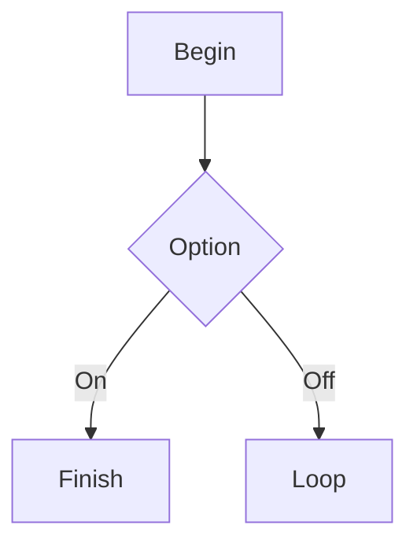

# Markdown Elements — Revised Catalog

Reference document with common Markdown / GFM elements supported in Beardy2 (title replaced).

## Headings

### Third level (renamed)

#### Level four

##### 5th level

###### Level six

## Inline text

Plain paragraph with **strong**, *emphasis*, ~~removed text~~, ***emphasis strong***, `snippet`, and a [link to Apple Developer](https://developer.apple.com "Developer portal").

Autolink test: <https://replaced.example.net>

Line with hard break (two trailing spaces):  
Following line after the break.

## Blockquote

> Quote opening line.
> Quote second line with **heavy** and `snippet` inside.

## Thematic break

---

## Unordered list

- East item
- Middle item
  - Nested one
  - Nested two
- West item

## Ordered list

1. Plan
2. Run
  1. Child A
  2. Child B
3. Verify

## Task list

- [x] Finished task
- [x] Formerly open task
- [ ] Still open task

## Fenced code (Swift)

```swift
struct Post {
    let headline: String
    let charCount: Int
}
```

## Fenced code (plain)

```
text fence block
without language
```

## Mermaid diagram



## Table

| Column      | State  | Comment      |
|-------------|--------|--------------|
| Titles      | Done   | Levels 1–6   |
| Grids       | Done   | Pipe syntax  |
| Fences      | Done   | Themes       |
| Pictures    | Done   | Relative URL |

## Image


## Math

Inline: $F = ma$

Display:

$$
\prod_{k=1}^{n} k = n!
$$

## Raw HTML snippet

<kbd>Ctrl</kbd> + <kbd>S</kbd> to store.

## Closing

Last paragraph. Fixture label: **revised**.
