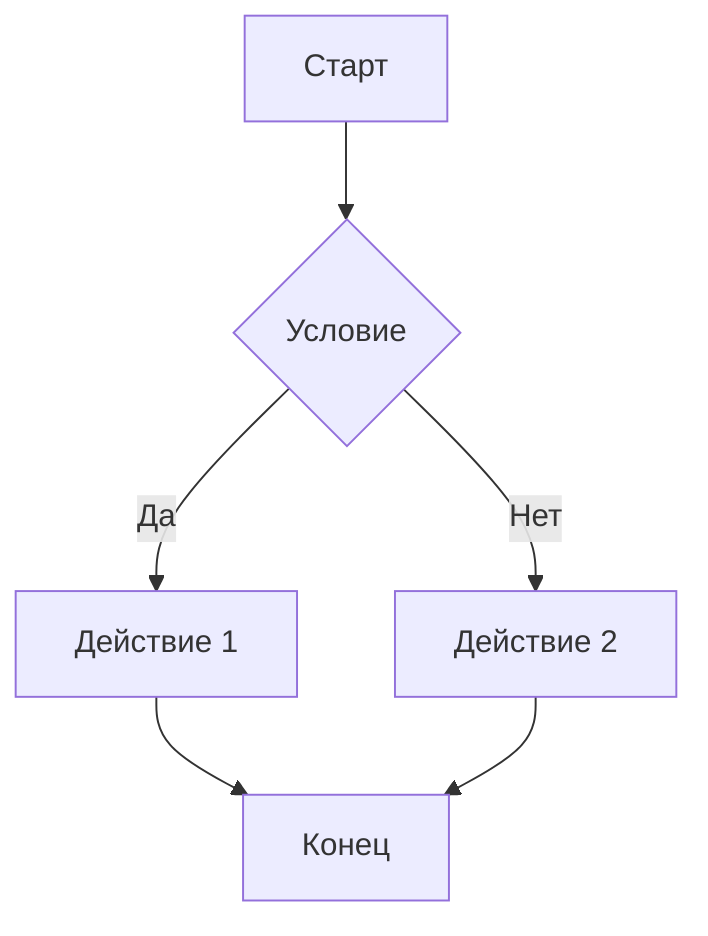
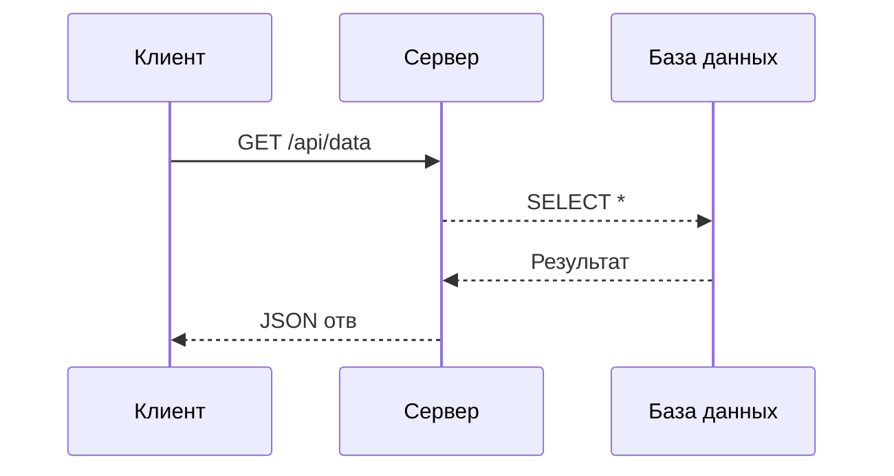

# Заголовок первогофывафывафвыа у55577788888ровня8989

## Заголовок второго уровня
### Заголовок
```javascript
третьегои
Ьиьиьбиоо

"Sdfgsdfgsdfвавафывфыафывафываваg"
"sdfgsdfgsdf"
"asdfывапывапывапa"
"sdfgsdfg"

```
уровня
#### Загвафвыаоловок четвёртого уровня
##### Заголовок пятого уровня
###### Заголофыафывпафывапывок шестого уровня
"Asdfgsdfgs"

---

## Текст и форматование 222


—\


```
Lorem ips


dolor sit eiusmod tempor incididunt ut labore et dolore magna aliqua.

```

```
**Жирй текст** и __тоже жирный текст_
Ёпоплоплоплоп
_


```
`*Курсивй текст* и _тоже курсивный_`

***Жй и мрака666
```
курсивн
иь
```
и ___тоже жирный и курсивный___


~~Зачёркнутст~~

`Инлайн код`

```
Тст с <sub>подстрочным</sub>
Gjhgjgjjgh
```

и <sup>надстрочным</sup> индексом
Hkjhk


```
jkgfjhgfjkgkj
```

---

## Списки

### Ненумерованный список

- Второй элемент
- Третий элемент
- Вложенный элемент
- Ещё вложенный
- Глубоко вложенный
- Четвёртый элемент

### Ненумерованный со звёздочками
дрл длр лр р др дрд лрд рдлр

- Элемент со звёздочкой
- Ещё один
- Вложенный

### Ненумерованный
```

```
с плюсами

- Элемент с плюсом
- Ещё один
- Вложенный

### Нумерованный список

1. Первый
2. Второй
3. Второй вложенный
4. Четвёртый

### Нумерованный с произвольными числами


```
### Список задач (Task list)

```


- [ ] Выполненная задача
- [x] Ещё одна выполненная
- [x] Невыполненная задача
- [x] Тоже невыполненная
- [ ] Вложенная выполненная

---

## Ссылки

[Обычная ссылка](https://example.com)

[Ссылка с тайтлом](https://example.com "Это тайтл при наведении")

[Ссылка на якорь](#заголовок-второго-уровня)

Автоссылка: <https://example.com>

Автоссылка email: <test@example.com>

Справочная ссылка: [текст ссылки][ref1]


---

## Изображения


[](https://example.com)

Справочное изображение: ![Alt текст][img1]


---

## Цитаты (Blockquotes)

> Простая цитата

> Многострочная цитата.
> Продолжение цитаты на следующей строке.
> Ещё одна строка.

> Цитата с **форматвывафывафываированием** и `кодом`

> Вложенные цитаты:
>
> > Первый уровень вложенности
> >
> > > Второй уровень вложенности

> Цитата с другими элементами:
>
> - Список внутри цитаты
> - Второй элемент
>
> И параграф внутри цитаты.

---

## Код

### Инлайн код

```swift
ьибьитбьи
ибьибьи
Используй `console.log()` для отладки. Переменная `const x = 42` объявлена.
```


### Блок кода без подсветки

```
Просто блок кода
без подсветки синтаксиса
с отступами
```

### JavaScript

```javascript
const greet = (name) => {
console.log(`Hello, ${name}!`);
return name.toUpperCase();
};

// Вызов функции
greet('World');
```

### TypeScript

```typescript
interface User {
id: number;
name: string;
email?: string;
}
function getUser(id: number): Promise<User> {
return fetch(`/api/users/${id}`)
.then(res => res.json());
}
```

### Python

```python
def fibonacci(int) -> list[int]:
"""Возвращает чисел Фибоначчи до n."""
a, b = 0, 1
result = []
while a < n:
result.append(a)
a, b = b, a + b
return result

print(fibonacci(100))

```

### Bash

```bash
#!/bin/bash
for file i
echo "Processing: $file"
cat "$file" | grep -i "error" >> errors.log
done
```

### JSON

```json
{
"name": "test-project",
"version": "1.0.0",
"dependencies": {
"react": "^18.0.0"
"typescript": "^5.0."
},
"scripts": {
"start": "react-sipts start",
"build": "react-scripts build"
}
}
```

### CSS

```css
.container {
display: flex;
flex-direction: column;
align-items: center;
gap: 16px;
```
### SQL

```sql
SELECT u.name, COUNT(o.id) AS order_count
FROM users u
LEFT JOIN orders  ON u.id = o.user_id
WHERE u.created_at > '2024-01-01'
GROUP BY u.id, u.name


HAVING order_count > 5
```

---

## Таблицы

### Простая таблица

| Колонка 1 | Колонка 2 | Колонка 3 |
| --- | --- | --- |
| Ячейка 1 | Ячейка 2 | Ячейка 3 |
| Ячейка 4 | ваавфававававаЯчейка 5 | Ячейка 6 |

### Таблица с выравниванием

| Левое выравнивание | По центру | Правое выравнивание |
|:-------------------|:---------:|--------------------:|
| Текст слева        |  Центр    |         Текст справа |
| Ещё текст          |    OK     |               12345 |
| Длинный текст      |   Test    |              99.99$ |**text****text***text*

### Таблица с форматированием внутри

| Название | Тип | Описание |
|----------|-----|----------|
| `id` | `number` | **Уникальный** идентификатор |
| `name` | `string` | Имя пользователя |
| `active` | `boolean` | ~~Устарело~~ Флаг активности |

---

## Горизонтальные разделители

Три дефиса:

---

Три звёздочки:

***

Три подчёркивания:

___

---


<br>

<div align="center">
Центрированный текст через HTML
</div>

<br>

Текст с <mark>выделением через HTML mark</mark> тегом.

---

## Математика (если поддерживается)

Инлайн формула: $E = mc^2$

Блочная формула:

$$\int_{-\infty}^{\infty} e^{-x^2} dx = \sqrt{\pi/2}$$

$$\frac{n!}{k!(n-k)!} = \binom{n}{k}$$

---

## Диаграммы Mermaid (если поддерживается)





---

## Сноски (если поддерживается)

Текст со сноской[^1] и ещё одной сноской[^note].

---

## Определения (если поддерживается)

Термин
: Определение термина

Markdown
: Язык разметки для форматирования текста

HTML
: HyperText Markup Language
: Язык гипертекстовой разметки

---

## Комбинированные примеры

### Список с кодом и цитатами

1. Первый шаг — инициализация:
```
npm init -y


```

1. Второй шаг — установка зависимостей:
```bash
npm install react react-dom

```

1. Третий шаг — запуск:
> Убедись что порт 3000 свободен
```
npm start

```

### Таблица с кодом

| Команда | Описание |
|---------|----------|
| `git init` | Инициализация репозитория |
| `git add .` | Добавить все файлы |
| `git commit -m "msg"` | Создать коммит |
| `git push origin main` | Отправить на сервер |

### Вложенные цитаты с форматированием

> ### Заголовок внутри цитаты
>
> Параграф с **жирным** и *курсивом*.
>
> ```javascript
> console.log('код внутри цитаты');
> ```
>
> - Список
> - Внутри цитаты

---

## Экранирование спецсимволов

\*Не курсив\*

\**Не жирный\**

\`Не код\`

\# Не заголовок

\- Не список

\[Не ссылка\]

Спецсимволы: \\ \` \* \_ \{ \} \[ \] \( \) \# \+ \- \. \!

---

*Конец тестового файла*
[link text]([url]([url](url)))
