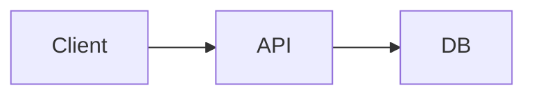

# BlackBeard Editor website — screenshot capture guide

Replace each placeholder under `assets/img/screenshots/` with real PNG or WebP exports (2× retina recommended: width **2560px** for 16:10 frames). Provide **both light and dark** variants for every shot.

**Naming convention:** `{id}-{theme}.png` — e.g. `hero-light.png`, `hero-dark.png`, `split-dark.png`.

**How to capture on macOS**

1. Open BlackBeard Editor with the window sized ~**1440×900** (or full screen on a large display).
2. Use **⌘⇧4**, then **Space** to capture the window, or **⌘⇧5** → “Capture Selected Window”.
3. Match the app theme to the filename (`light` / `dark`). Use **⌘T** to switch editor themes; use macOS light/dark mode for chrome if needed.
4. Remove personal paths from sidebars when possible; use sample documents below.

**Sample document for demos** (save as `beardy-demo.md`):

```markdown
# API design notes

## Authentication

Use bearer tokens with short TTL.

```swift
func validate(token: String) async throws -> Session
```

## Flow



Inline math: $E = mc^2$, display:

$$
\int_0^1 x^2 \, dx = \frac{1}{3}
$$
```

---

## 1. `hero` — Main hero (home page)

| Variant | App state |
|--------|-----------|
| **light** | Welcome screen: “Markdown Editor”, three cards (New / Open / Import), light UI theme, empty or 2–3 benign recent files. |
| **dark** | Same layout, dark app theme (e.g. One Dark / Night). |

**File:** `hero-light.png`, `hero-dark.png`

---

## 2. `split` — Split mode

| Variant | App state |
|--------|-----------|
| **light** | Document open with headings, code block, and list; **Split** mode; outline panel **visible** on the left; preview synced; theme **light**. |
| **dark** | Same document, **Split**, outline on, **dark** code + preview theme. |

**File:** `split-light.png`, `split-dark.png`

---

## 3. `live` — Live (WYSIWYG) mode

| Variant | App state |
|--------|-----------|
| **light** | **Live** mode; cursor in a paragraph; show rendered heading + one math block or Mermaid diagram from sample doc. |
| **dark** | Same, dark theme. |

**File:** `live-light.png`, `live-dark.png`

---

## 4. `outline` — Outline navigation

| Variant | App state |
|--------|-----------|
| **light** | Long doc with H1–H3; outline panel open; **one heading highlighted** as active; optional: mid-scroll so outline + editor both visible. |
| **dark** | Same, dark theme. |

**File:** `outline-light.png`, `outline-dark.png`

---

## 5. `themes` — Theme picker

| Variant | App state |
|--------|-----------|
| **light** | **⌘T** theme panel open over editor; show several theme families in the list; editor behind uses light theme. |
| **dark** | Theme panel over dark editor. |

**File:** `themes-light.png`, `themes-dark.png`

---

## 6. `export` — Export / share

| Variant | App state |
|--------|-----------|
| **light** | Export sheet or menu visible (PDF/HTML/PNG); document with formatted preview in background. |
| **dark** | Same, dark UI. |

**File:** `export-light.png`, `export-dark.png`

---

## Logo placeholder

Replace `assets/img/logo.svg` (or PNG) with final BlackBeard Editor mark. Recommended: **512×512** master, SVG for site header, PNG for Open Graph `og-image.png` (**1200×630**).

---

## After adding images

1. Update each `.shot-placeholder` block in HTML to `` inside `.shot-variant`.
2. Keep `data-shot-variant` wrappers for light/dark tabs.
3. Add descriptive `alt` text per language in each `index.html`.
